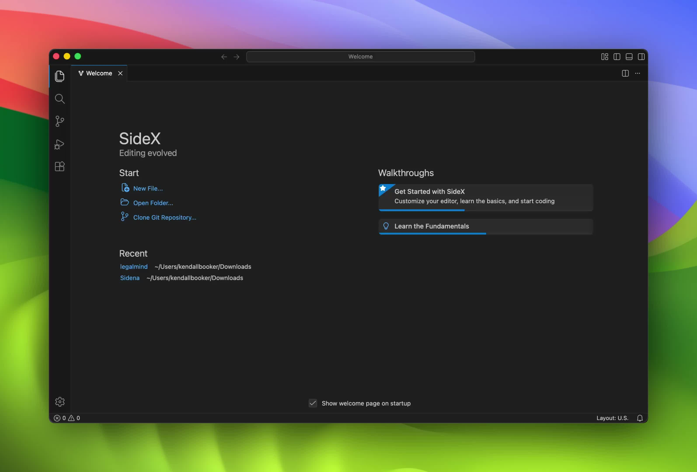
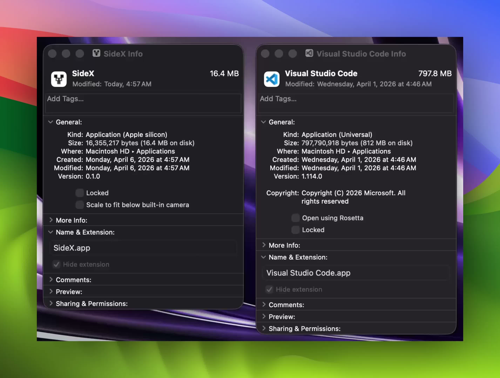

<h1 align="center">SideX</h1>

<p align="center">
  <strong>VSCode's workbench, without Electron.</strong>
</p>

<p align="center">
  <a href="https://discord.gg/8CUCnEAC4J"></a>
  <a href="https://github.com/Sidenai/sidex/issues"></a>
  <a href="LICENSE"></a>
  
</p>

<br>

<p align="center">
  
</p>

<br>

<p align="center">
  <a href="#why">Why</a> · <a href="#whats-working">What's Working</a> · <a href="#getting-started">Getting Started</a> · <a href="#how-its-built">How It's Built</a> · <a href="#contributing">Contributing</a> · <a href="https://discord.gg/8CUCnEAC4J">Discord</a>
</p>

---

SideX is a port of Visual Studio Code that replaces Electron with [Tauri](https://tauri.app/) — a Rust backend and OS's native webview. The same TypeScript workbench, the same editor, terminal, and Git integration, running without a bundled browser.

> **Early release.** Core editing and the terminal are solid. The extension host and debugger are still in progress. See [What's Working](#whats-working) for the full picture.

---

## Why

VSCode's memory useage is almost entirely from its bundled Chromium, not the editor itself. Tauri replaces that with the webview already on your system — WKWebView on macOS, WebView2 on Windows — shared across apps and costing almost nothing extra.

<p align="center">
  
</p>

RAM savings are most tested on macOS, WKWebView is shared with Safari. On Windows the picture is more nuanced — WebView2 memory can look higher depending on how it's measured, and [it's an active area in the Tauri ecosystem](https://github.com/tauri-apps/tauri/issues/5889). The target is **under 200 MB at idle** on macOS. We'll publish real benchmarks once the app is stable enough for them to be meaningful.

---

## What's Working

**Solid:**

- Monaco editor with syntax highlighting and basic IntelliSense
- File explorer — open folders, create, rename, delete
- Integrated terminal — full PTY via Rust, shell detection, resize, signals
- Git — status, diff, log, stage, commit, branch, push/pull/fetch, stash, reset
- Themes — multiple built-in themes from the VSCode catalogue
- Native OS menus (macOS, Windows, Linux)
- Extension installation from [Open VSX](https://open-vsx.org/)
- File watching, file search, full-text search, Rust-backed search index
- SQLite storage, document management (autosave, undo/redo, encoding)

---

## Getting Started

### Run in Development

```bash
git clone https://github.com/Sidenai/sidex.git
cd sidex
npm install
npm run tauri dev
```

### Build from Source

```bash
npm install

# macOS / Linux
NODE_OPTIONS="--max-old-space-size=12288" npm run build

# Windows (PowerShell)
$env:NODE_OPTIONS="--max-old-space-size=12288"
npm run build

npx tauri build
```

First build takes 5–10 minutes (Rust compile time). Pre-built binaries are not distributed yet.

---

## How It's Built

SideX maps VSCode's Electron architecture onto Tauri layer by layer:

| VSCode (Electron) | SideX (Tauri) |
|---|---|
| Electron main process | Tauri Rust backend |
| `BrowserWindow` | `WebviewWindow` |
| `ipcMain` / `ipcRenderer` | `invoke()` + Tauri events |
| Node.js `fs`, `pty`, etc. | Rust commands (`std::fs`, `portable-pty`) |
| Menu / Dialog / Clipboard | Tauri plugins |
| Renderer (DOM + TypeScript) | Same — runs in native webview |
| Extension host | Sidecar process (in progress) |

The TypeScript frontend is a direct port of VSCode's workbench. The Rust backend is in `src-tauri/src/commands/` and handles everything that would have been a Node.js native module: file I/O, terminal PTY, Git, file watching, search indexing, SQLite, and process management.

### Project Layout

```
sidex/
├── src/                    # TypeScript workbench (ported from VSCode)
│   └── vs/
│       ├── base/           # Core utilities
│       ├── platform/       # Platform services and dependency injection
│       ├── editor/         # Monaco editor
│       └── workbench/      # IDE shell, panels, features, contributions
├── src-tauri/              # Rust backend
│   └── src/
│       ├── commands/       # fs, terminal, git, search, debug, etc.
│       ├── lib.rs          # App setup and command registration
│       └── main.rs         # Entry point
├── index.html
├── vite.config.ts
└── package.json
```

### Tech Stack

| Layer | Technology |
|---|---|
| Frontend | TypeScript, Vite 6, Monaco Editor |
| Terminal UI | xterm.js + WebGL renderer |
| Syntax / Themes | vscode-textmate, vscode-oniguruma (WASM) |
| Backend | Rust, Tauri 2 |
| Terminal | portable-pty (Rust) |
| File watching | notify crate (FSEvents on macOS) |
| Search | dashmap + rayon + regex (parallel, Rust) |
| Storage | SQLite via rusqlite |
| Extensions | Open VSX registry |

For a deeper dive, see [ARCHITECTURE.md](./ARCHITECTURE.md)

---

## Contributing

This was released early to get outside contributors involved.

### How to Contribute

1. Fork the repo and create a branch
2. Pick something — check [Issues](https://github.com/Sidenai/sidex/issues) or grab something from the Known Gaps list above
3. Submit a PR — contributors get credited

### Dev Notes

- Follows VSCode's patterns — familiar if you've read the VSCode source
- TypeScript imports use `.js` extensions (ES module convention)
- Services use VSCode's `@inject` dependency injection decorators
- New Rust commands go in `src-tauri/src/commands/` and register in `lib.rs`
---

## Community

- **Discord:** [Join the SideX server](https://discord.gg/8CUCnEAC4J)
- **X / Twitter:** [@ImRazshy](https://x.com/ImRazshy)
- **Email:** kendall@siden.ai

---

## License

MIT — SideX is a port of [Visual Studio Code (Code - OSS)](https://github.com/microsoft/vscode), which is also MIT licensed. See [LICENSE](./LICENSE) for details.
